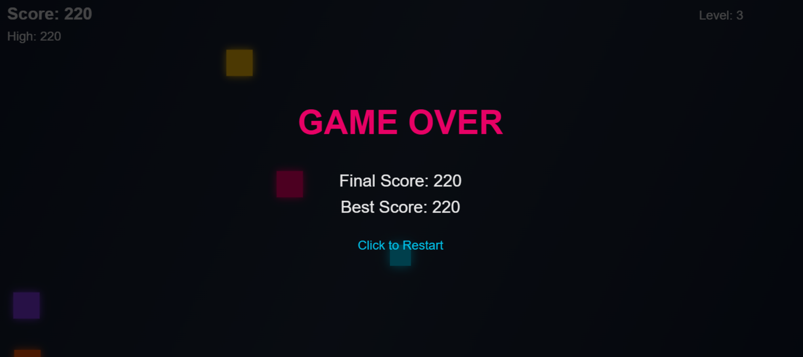

# 🕹️ Dodge Game

A fun and interactive browser-based Dodge Game where players must avoid incoming obstacles for as long as possible!  
Built using **HTML, CSS, and JavaScript**, this game tests your reflexes and reaction speed 👀⚡

🎯 **Play the Game:**  
🔗 https://dodgegame-ten.vercel.app/

---

## 📸 Screenshot



---

## 🚀 Features

- ✅ Simple & addictive gameplay  
- ✅ Smooth animations  
- ✅ Collision detection logic  
- ✅ Score tracking system  
- ✅ Responsive UI  
- ✅ Lightweight & fast (Pure JS — No frameworks)

---

## 🧠 Game Rules

- Control the player box and avoid hitting obstacles  
- Survive as long as possible to achieve a higher score  
- Game ends when you collide with an obstacle  
- Try to beat your high score every time!

---

## 🎮 Controls

| Action | Key |
|--------|-----|
| Move Left  | ⬅️ Left Arrow |
| Move Right | ➡️ Right Arrow |
| Jump | ⬆️ Up Arrow (if implemented) |

---

## 🛠️ Technologies Used

| Technology | Purpose |
|-----------|---------|
| HTML | Game structure |
| CSS | Styling & animations |
| JavaScript | Game logic & controls |
| Vercel | Live Deployment |

---

## 📂 Folder Structure
```
project/
│── index.html
│── style.css
│── script.js
│── public/
│ └── img.png # Game preview screenshot
└── README.md
```

## ⚙️ Installation & Running Locally

```
# Clone the repo
git clone https://github.com/redasaniharsh/dodge-game.git

# Go into the project folder
cd dodge-game
```

# Run locally by opening index.html


Simply open index.html in your browser.

📈 Future Improvements

🎵 Add background sound & effects

🧱 More obstacles & difficulty levels

🏅 Leaderboard system

👤 Character skins

📱 Mobile touch support

👨‍💻 Developer

Harsh Redasani
📎 GitHub: https://github.com/redasaniharsh

💡 Passionate about Web and Game Development

📝 License

This project is open-source and free to use.

⭐ If you like this game, give the repo a star!
⭐ Star this repository to support more awesome projects!


Enjoy playing and improving your reflexes! 🚀🔥
